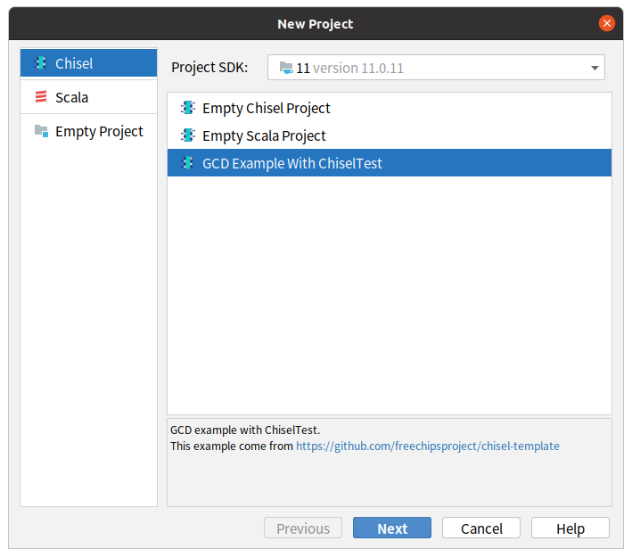

## Chisel plugin for IntelliJ platform

### Features

- Create new Chisel project based on projectWizard and templates
- Create Chisel module and test from fileTemplates
- Open/Search Chisel/Firrtl API Documentation

### Build

1. [Learn](https://plugins.jetbrains.com/docs/intellij/basics.html) how to develop an IntelliJ Plugin with Gradle

2. Modify the build.gradle file according to your environment, you need to be very familiar with the relevant settings listed at https://github.com/JetBrains/gradle-intellij-plugin